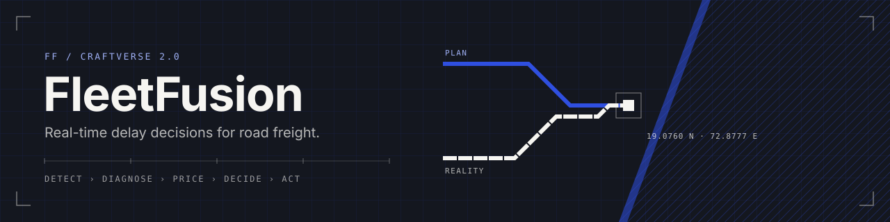
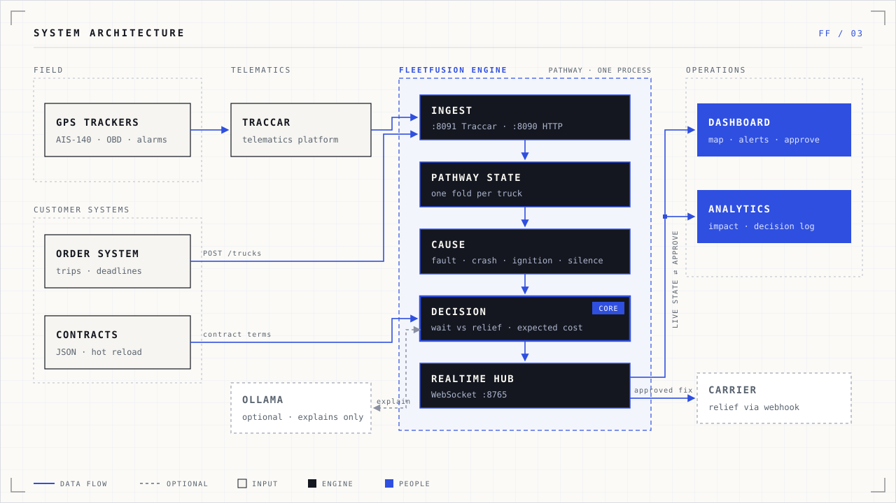
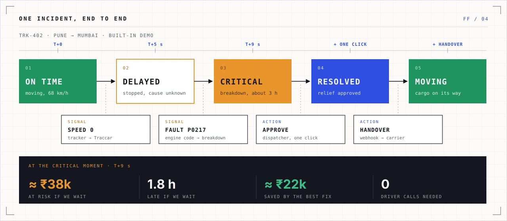
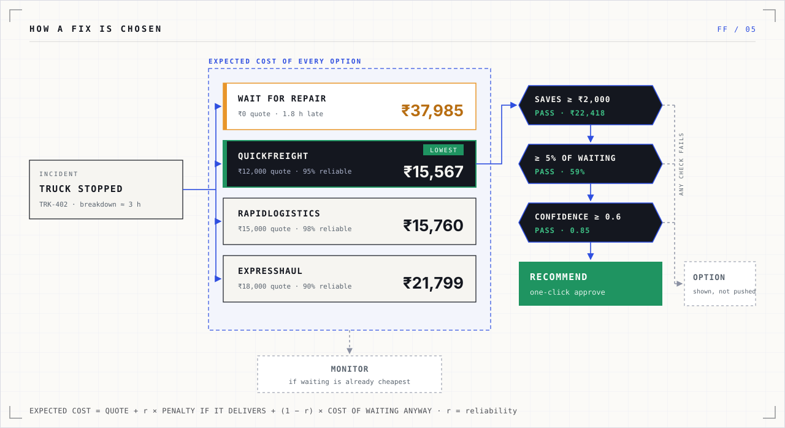
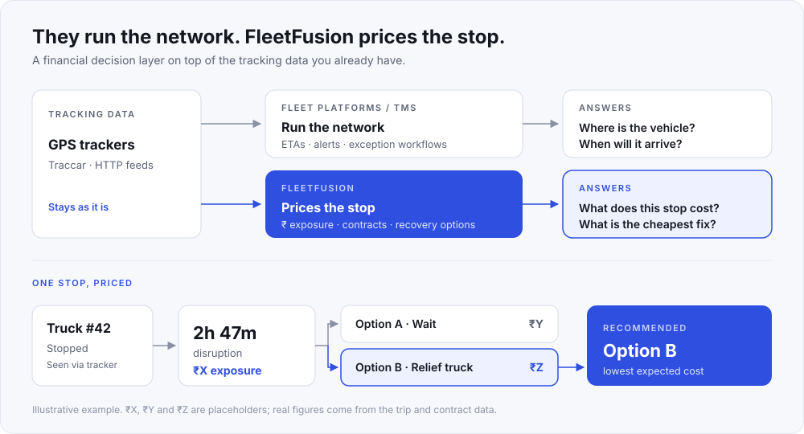

When a truck stops, FleetFusion prices the delay against the customer's contract and recommends the cheapest way to recover, within seconds.

## `01` Why

A stalled truck costs money long before anyone notices. Usually the bill shows up as a late-delivery penalty, after it's too late to act.

- Trucks lose **5–25% of journey time** to stoppages (TCI–IIM highway study).
- **63%** of the 6,880 real delivery trips in our source dataset were flagged delayed.

## `02` What it does

| | |
|---|---|
| `DETECT` | Reads the GPS trackers trucks already carry, through Traccar. No driver app. |
| `DIAGNOSE` | Infers why it stopped from machine signals: fault codes, crash sensor, ignition, silence. |
| `PRICE` | Applies the contract: deadline, penalty per hour, cap, cold-chain limit, force majeure. |
| `DECIDE` | Compares waiting against every relief truck by expected cost, including the risk a relief fails. |
| `ACT` | An operator approves in one click; the decision goes back to the carrier by webhook. |

Every number is deterministic. A local model (Ollama) can rewrite the explanation in plain words; switching it off changes nothing else.

## `03` Architecture



## `04` One incident, end to end



> The scripted breakdown from the built-in simulator (`FEED=internal`). In the default Traccar demo the same flow runs on any of TRK-101–116 when you inject an incident.

## `05` How a fix is chosen



> Computed by `core/arbitrage.py` for the demo breakdown. Values shift slightly with the exact second the truck stops.

## `06` Impact (simulated)

Same fleet, same incidents, handled two ways: **today** (noticed after about 60 min, then 45 min of phone calls) and **with FleetFusion** (signal in about 3 min, recommendation executed).

| Per incident | Today | FleetFusion |
|---|---|---|
| Cost | ₹7,705 | **₹3,639** |
| Ends in a late delivery | 24% | **12%** |
| Relief truck booked | 29% | **14%** |

**Saving: ≈ ₹9 L a month per 100 trucks.**

Assumes 8 incidents per 100 trips, 300 km/day, 26 days a month. Range: ₹3.0 L to ₹16.2 L a month depending on incident rate and discovery delay. Reproduce with `scripts/impact_report.py`, or use the live calculator in Analytics.

## `07` Run it

Needs Node.js 18+, Python 3.10+, and Docker (optional).

```bash
./start-demo.sh
```

Open `http://localhost:3000/dashboard` and sign in with `demo@fleetfusion.com` / `demo123`.

With Docker running, the demo starts Traccar and 16 simulated trackers on real South-India lanes; without Docker it falls back to the built-in simulator (`FEED=internal`).

**Traccar's own map** is at `http://localhost:8082`. First time only: create the admin account there, then link the trackers to it so they appear in its list:

```bash
python3 infra/traccar_link_devices.py
```

```bash
docker restart fleetfusion-traccar
```

The demo clock runs 30× faster so trips play out in minutes, which is why dates in Traccar run ahead of today.

Cause an incident from the backend, the way real data would arrive:

```bash
python3 backend-pathway/scripts/inject.py breakdown
```

Other types: `accident`, `flat_tyre`, `traffic`, `checkpoint`, `tracker_offline`; `list` shows every truck. Stop everything with `./cleanup-demo.sh`.

**Optional AI explanations** (local, free): install [Ollama](https://ollama.com), run `ollama serve`, then `ollama pull llama3.2:3b` (the default in `backend-pathway/.env`). Smaller models (1b) get the recommendation wrong too often, so their text is rejected and the engine's own summary is shown. Explanations whose figures or choice don't match the engine are always dropped; decisions are identical with AI on or off.

## `08` Connect a real fleet

- **Traccar:** point any supported tracker at your Traccar server and forward positions and events to FleetFusion on port `8091` (config in `infra/traccar/traccar.xml`).
- **HTTP:** register a trip with `POST /trucks` and stream readings to `POST /telemetry` on port `8090`.
- **Contracts:** JSON files in `backend-pathway/data/contracts/`. Edit one and decisions update live.

**Security:** the dashboard connection only accepts browsers from `WS_ALLOWED_ORIGINS` (default `http://localhost:3000`). Login tokens for operator actions and API keys for data ingest are still to do before hosting it publicly.

## `09` Stack

| Layer | Tools |
|---|---|
| Streaming engine | Python, Pathway |
| Telematics | Traccar 6 (Docker) |
| Dashboard | Next.js 16, React 19, Tailwind, Leaflet + OpenStreetMap |
| Roads | OSRM over OpenStreetMap |
| Optional AI | Ollama, local |

One process handles **3,000 truck readings per second** on a laptop (about 450 MB). Benchmark: `backend-pathway/scripts/benchmark.py`.

## `10` How it compares

**They run the network. FleetFusion prices the stop.**

FleetFusion is not a replacement for a fleet-management platform, TMS or shipment-visibility system like FourKites, project44 or Samsara. It is a financial decision layer on top of existing tracking data: it turns a vehicle disruption into an explainable rupee cost and compares recovery options.



| | Fleet platforms | FleetFusion |
|---|---|---|
| `ASKS` | Where is the vehicle, and when will it arrive? | What will this disruption cost, and what is the cheapest recovery? |
| `DECIDES BY` | ETAs, alerts, exception workflows | Rupee impact: waiting cost vs. recovery options |
| `CONTRACTS` | Varies by platform | Penalties, caps, grace periods, cold-chain and force-majeure rules, applied deterministically in code |
| `AI` | Can be central | Optional. Core calculations work with AI switched off |
| `FITS IN` | Full platform | Consumes your existing tracker data (Traccar / HTTP) |

> Keep the tracker. Add the financial decision layer.

> FleetFusion is currently a prototype running on simulated data. Established platforms lead on carrier networks, multimodal visibility, enterprise integrations and production scale.

## `11` Layout

```
app/ components/ lib/        Dashboard and analytics (Next.js)
backend-pathway/
  core/                      Decision logic, penalties, impact model
  pipeline/                  Pathway streaming graph
  connectors/                Traccar, simulator, operator commands
  realtime/                  WebSocket hub
  devices/                   Simulated GPS trackers
  data/                      Contracts, fleet lanes, demo scenario
  tests/                     45 tests
infra/                       Traccar setup
docs/                        Product notes and decision log
```

## Checks

```bash
cd backend-pathway && PYTHONPATH=. venv-pathway/bin/python -m pytest tests/
```

```bash
npm run lint && npm run type-check && npm run build
```

---

Fleet data: derived from "Delivery truck trips data" (Kaggle, CC BY-SA 3.0). Contract penalty rates are illustrative.
