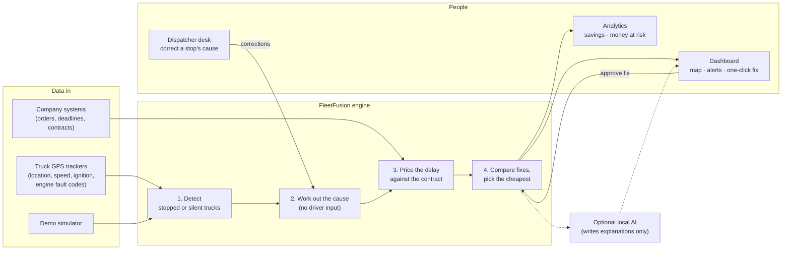
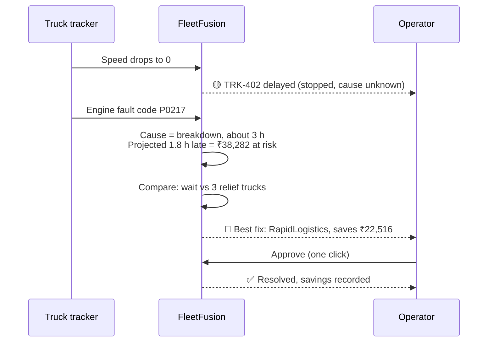

# FleetFusion

**When a truck breaks down, FleetFusion tells you within seconds what the delay will cost and the cheapest way to fix it.**

Built for the Craftverse 2.0 hackathon. Full feature list, data sources and priorities: [`docs/PRODUCT.md`](docs/PRODUCT.md).

---

## The problem

- India spends **₹24 lakh crore a year on logistics** (7.97% of GDP, DPIIT–NCAER study, FY24).
- Trucks lose **5–25% of their journey time to stoppages** (TCI–IIM highway freight study).
- When a truck stalls, nobody knows what the delay will cost until the late-delivery penalty arrives. By then it's too late to act.

## What FleetFusion does

1. **Notices a stalled truck** from the GPS tracker it already carries. No driver app, no phone calls.
2. **Works out why it stopped** from vehicle signals: engine fault, crash sensor, engine idling, weather or checkpoint. Office staff can correct the cause if needed.
3. **Prices the delay** using that customer's contract: deadline, penalty per hour, penalty cap, cold-chain limits, force majeure.
4. **Compares every way to fix it**, from waiting it out to each available relief truck, and picks the cheapest overall (not just the cheapest quote).
5. **Lets an operator approve it in one click**, then tracks money saved, penalties avoided and extra CO₂.

**Works without AI.** Every number comes from plain, checkable calculations. A local AI model can optionally write a
friendlier explanation, and switching it off changes nothing else.

---

## How it works



### What happens to one breakdown



---

## Run it

You need **Node.js 18+** and **Python 3.10+**.

```bash
./start-demo.sh
```

Then open **http://localhost:3000/dashboard** and log in with `demo@fleetfusion.com` / `demo123`.

To stop everything:

```bash
./cleanup-demo.sh
```

### What you'll see in the demo

| Time | What happens |
|---|---|
| 5 s | TRK-402 stops. It shows as **delayed** (cause unknown). |
| 9 s | Its tracker sends an engine fault code. It turns **critical** and a popup compares every fix. |
| 25 s | TRK-518's tracker goes silent. It turns grey: **signal lost**. |
| 90 s | TRK-518's tracker comes back. |

Try these:
- **Execute the fix** in the popup, then open **Analytics** to see the savings recorded.
- Use the **Dispatcher desk** (left sidebar) to change why a truck stopped, and watch the cost change.
- Flip the **AI explanations** switch. Decisions stay exactly the same.

### Optional: local AI explanations

The app works fully without AI. To get friendlier, AI-written explanations, install [Ollama](https://ollama.com)
(free, runs on your laptop, no account needed):

```bash
brew install ollama
```

```bash
ollama pull llama3.2:3b
```

```bash
ollama serve
```

Restart FleetFusion and the **AI explanations** switch in the dashboard becomes active.

### Manual setup (instead of `start-demo.sh`)

```bash
cd backend-pathway
python3 -m venv venv-pathway && source venv-pathway/bin/activate
pip install -r requirements-pathway.txt
cp .env.example .env
python main.py
```

In a second terminal:

```bash
npm install && npm run dev
```

---

## Connecting real trucks

Any GPS tracker or tracking platform can send data to FleetFusion over HTTP.

Register a truck:

```bash
curl -X POST localhost:8090/trucks -H 'Content-Type: application/json' -d '{"truck_id":"DEV-1","driver":"A","contract_id":"CNT-2024-003","cargo_value":5000000,"route":"[[88.36,22.57],[85.82,20.29]]"}'
```

Send a reading (here: stopped, engine off, engine fault):

```bash
curl -X POST localhost:8090/telemetry -H 'Content-Type: application/json' -d '{"truck_id":"DEV-1","ts":1760000000,"lat":22.4,"lon":88.1,"speed_kmh":0,"fault_code":"P0217","ignition":0,"trip_started_at":1759990000}'
```

Contracts are simple JSON files in [`backend-pathway/data/contracts/`](backend-pathway/data/contracts/). Edit one and decisions update immediately.

---

## Built with (all free)

| Part | Technology |
|---|---|
| Real-time engine | Python + [Pathway](https://pathway.com) (free to use) |
| Dashboard | Next.js, React, Tailwind CSS |
| Maps | Leaflet + OpenStreetMap |
| Optional AI | Ollama (runs locally) |

No paid services or API keys.

## Proven at scale

On a single laptop, FleetFusion keeps up with **3,000 trucks sending a reading every second** (about 450 MB of memory).
Run the test yourself: `backend-pathway/scripts/benchmark.py`.

## Project layout

```
app/, components/, lib/     Dashboard (Next.js)
backend-pathway/
  core/                     The decision logic: delays, penalties, picking the cheapest fix
  pipeline/                 Real-time processing of incoming truck data
  connectors/               Demo simulator and operator actions
  realtime/                 Live connection to the dashboard
  llm/                      Optional AI explanations
  data/contracts/           Sample customer contracts (₹)
  data/scenarios/           The scripted demo
  tests/                    30 automated tests
docs/PRODUCT.md             Features, data sources, priorities
```

## Checks

```bash
cd backend-pathway && PYTHONPATH=. venv-pathway/bin/python -m pytest tests/
```

```bash
npm run lint && npm run type-check && npm run build
```
