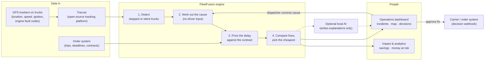
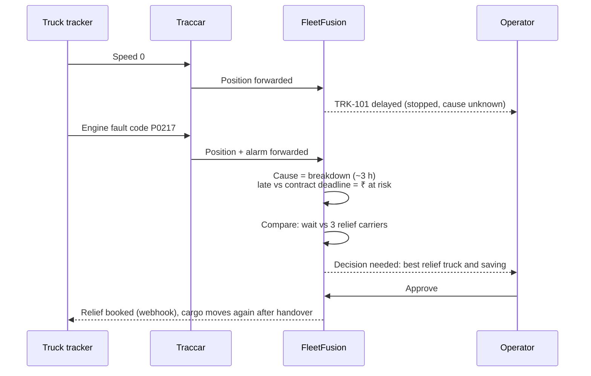

# Proposed README changes

The current README describes the project before the Traccar integration, the real dataset, the impact
comparison and the UI overhaul. Below: what is out of date, and ready-to-paste replacements.

| # | Section | Problem | Change |
|---|---|---|---|
| 1 | What you'll see in the demo | The TRK-402 / TRK-518 timeline only happens in the built-in simulator mode. `./start-demo.sh` now runs **Traccar mode** by default (16 real-lane trucks TRK-101–116) | Replace the table (see A) |
| 2 | Try these | "Trigger breakdown / Reset" buttons are hidden in Traccar mode; the "Dispatcher desk" sidebar no longer exists (it moved into the truck panel) | Replace the list (see A) |
| 3 | How it works (flowchart) | Trackers reach FleetFusion through Traccar; "Dispatcher desk" node is outdated | Replace the diagram (see B) |
| 4 | One breakdown (sequence) | Emoji don't match the calm product UI; Traccar hop missing | Replace the diagram (see B) |
| 5 | Missing | Real dataset (Kaggle, 16 lanes, 63% late baseline, validation, anonymisation) | Add section C |
| 6 | Missing | Impact comparison (₹9 L/month per 100 trucks, with assumptions) | Add section D |
| 7 | Run it | Docker (for Traccar) and the Traccar device-link step aren't mentioned; AI model advice for 8 GB Macs | Replace "Run it" requirements (see E) |
| 8 | Connecting real trucks | Traccar forwarding is now the primary path | Add a Traccar subsection (see F) |
| 9 | Project layout / tests | Missing `devices/`, `infra/`, `data/fleet/`, new scripts; tests are now 40 | Replace layout (see G) |
| 10 | Missing | Security note (WebSocket origin allow-list; auth still to do) | Add one line (see G) |

---

## A. Demo (replaces "What you'll see in the demo" and "Try these")

```markdown
### What you'll see in the demo

`./start-demo.sh` starts a real open-source tracking platform (Traccar), 16 simulated GPS trackers driving
real South-India lanes from an open dataset, the FleetFusion engine and the dashboard. Time runs 30× faster
so movement is visible. Incidents happen on their own; to cause one on cue (the "manipulate the backend" demo):

    cd backend-pathway && venv-pathway/bin/python scripts/inject.py breakdown

About 5 s later the truck shows as **delayed** (stopped, cause unknown); about 11 s later its tracker reports an
engine fault through Traccar and FleetFusion asks for a **decision**. Other types: `accident`, `flat_tyre`,
`traffic`, `checkpoint`, `tracker_offline`; `inject.py list` shows every truck.

Try these:
- **Approve** the recommendation, then open **Impact & analytics** to see the saving recorded.
- Click any truck (incidents list or map) to see its contract, the options compared, and the **cause of stop**
  control for dispatchers: change it and watch the price change.
- Flip **AI explanations** in the sidebar. Decisions stay exactly the same.
- Open Traccar at http://localhost:8082 to see the same trucks and the raw fault alarms.

No Docker? `FEED=internal ./start-demo.sh` runs the built-in simulator instead (scripted TRK-402 breakdown,
plus **Breakdown / Reset** demo buttons in the top bar).
```

## B. Diagrams





## C. Real data (new section)

```markdown
## Real data

The demo fleet runs on **real Indian truck lanes** from the open dataset
["Delivery truck trips data"](https://www.kaggle.com/datasets/ramakrishnanthiyagu/delivery-truck-trips-data)
(6,880 trips, mostly automotive supply chain, CC BY-SA 3.0).

- 16 most frequent South-India lanes (60–700 km), snapped to real roads with OpenStreetMap routing.
- Data quality check: lanes whose coordinates disagree with their stated distance were rejected (8 lanes).
- **63% of the 6,880 trips were flagged late** by the shipper: our "without FleetFusion" baseline.
- Driver names, phone numbers, vehicle plates and customer names are removed; customers become sector labels.
- Contract penalty rates and cargo values are **illustrative**; relief prices use published ₹45–85/km truck rates.

Rebuild: `cd backend-pathway && venv-pathway/bin/python scripts/build_fleet_dataset.py "data/external/<file>.xlsx"`
(the raw spreadsheet is not committed). Details: `backend-pathway/data/fleet/README.md`.
```

## D. Impact (new section)

```markdown
## Impact

The same incidents on the real lanes, handled two ways. **Today:** the stop is noticed after ~60 min, carriers are
phoned, the cheapest quote is booked for serious stops. **FleetFusion:** the tracker signal is seen in minutes and
the lowest expected-cost option is chosen. Both are scored on what actually happened.

| Per incident | Today | With FleetFusion |
|---|---|---|
| Cost (penalties + relief) | ₹7,705 | ₹3,639 (−53%) |
| Ends in a late delivery | 24% | 12% |
| Relief truck booked | 29% | 14% |

≈ **₹9 lakh a month per 100 trucks** in the middle case, ₹3–16 lakh across the assumption range
(incident rate is an assumption: no public data). Adjust the assumptions live in **Impact & analytics**, or run
`cd backend-pathway && venv-pathway/bin/python scripts/impact_report.py`.
```

## E. Run it (replace the requirements line and AI note)

```markdown
You need **Node.js 18+**, **Python 3.10+**, and **Docker** for the Traccar mode (on a Mac: `brew install colima docker`;
the launcher starts Colima for you). Without Docker the launcher falls back to the built-in simulator.

First run only, to see the trucks inside Traccar's own UI (http://localhost:8082, create the admin account first):

    python3 infra/traccar_link_devices.py

Optional AI explanations: on an 8 GB Mac use the smaller model to keep memory free:
`ollama pull llama3.2:1b` and set `LLM_MODEL=llama3.2:1b` in `backend-pathway/.env`.
```

## F. Connecting real trucks (add above the curl examples)

```markdown
### Through Traccar (recommended)

Point real trackers (200+ protocols, including AIS-140 devices) at Traccar, and set in Traccar's config:

    forward.type=json
    forward.url=http://<fleetfusion-host>:8091/integrations/traccar/positions
    event.forward.type=json
    event.forward.url=http://<fleetfusion-host>:8091/integrations/traccar/events

A ready config is in `infra/traccar/traccar.xml` (`./infra/traccar.sh up` runs it in Docker).

### Directly over HTTP
(keep the existing curl examples)
```

## G. Project layout and security (replace layout)

```
app/, components/, lib/       Dashboard (Next.js): operations, impact & analytics, landing, login
backend-pathway/
  core/                       Decision logic: delays, penalties, cheapest fix, impact comparison
  pipeline/                   Real-time processing of incoming truck data (Pathway)
  connectors/                 Traccar integration, built-in simulator, operator actions
  devices/                    Simulated GPS trackers that report to Traccar
  realtime/                   Live connection to the dashboard
  llm/                        Optional AI explanations
  data/fleet/                 Real lanes from the open dataset (derived, anonymised)
  data/contracts/             Contracts (₹), one per lane
  scripts/                    inject.py, impact_report.py, build_fleet_dataset.py, benchmark.py
  tests/                      40 automated tests
infra/                        Traccar config, Docker runner, device-link script
docs/                         PRODUCT.md (features, priorities), CONTEXT.md (decision log)
```

```markdown
**Security:** the live dashboard connection only accepts browsers from `WS_ALLOWED_ORIGINS`
(default `http://localhost:3000`). Login tokens for operator commands and API keys for data ingest are still to
do before hosting it anywhere public (see `docs/PRODUCT.md`).
```
